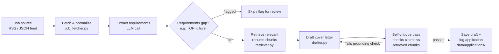

# Korea Job-Search Copilot

An agent that reads job postings, checks them against my own resume and skill
profile using retrieval-augmented generation, and drafts a tailored cover
letter — while flagging gaps (like Korean language level) before I waste time
applying to a role I'm not actually eligible for.

I built this to run my own job search for remote/Korea-based AI Engineer
roles. It's not a demo — the `data/applications/` log is genuinely how I'm
tracking my search.

## Why this exists

Generic "AI job matcher" tutorials match a resume PDF against a job
description with one embedding call and call it done. That's not enough for
my situation: I need the agent to reason about *visa/language requirements*,
*which parts of my resume are actually relevant to a given posting*, and to
avoid hallucinating experience I don't have. So the pipeline has an explicit
retrieval step grounded only in my own documents, plus a self-critique pass
that checks the draft against the retrieved facts before it's shown to me.

## Architecture



## Skills this project demonstrates

| Skill | Where |
|---|---|
| **Prompt engineering** | `src/drafter.py` — few-shot prompt built from my own past writing, explicit output format, self-critique prompt in `src/critique.py` |
| **RAG concepts** | `src/vector_store.py` + `src/retriever.py` — chunking, embedding, cosine-similarity retrieval, and a grounding check that rejects drafts referencing anything outside retrieved chunks |
| **Agentic AI** | `src/agent.py` — multi-step loop: fetch → extract → gap-check → retrieve → draft → critique → (re-draft if needed) → log |
| **APIs** | Anthropic Messages API for extraction/drafting/critique; job data via RSS/JSON adapters in `job_fetcher.py` |
| **AI Tools & Workflows** | End-to-end CLI pipeline chaining multiple LLM calls + a lightweight local vector store, no heavyweight framework dependency |
| **GitHub Projects** | This repo — real commit history, sample outputs in `examples/`, tests in `tests/` |

## Setup

```bash
pip install -r requirements.txt
cp .env.example .env   # add your ANTHROPIC_API_KEY
```

Put your resume as Markdown chunks (one skill/experience section per file or
`---`-separated) in `data/resume/`. A sample profile is already there so you
can run the pipeline immediately.

## Run it

```bash
# Demo run against sample job postings included in the repo
python -m src.agent --source data/jobs/sample_postings.json

# Against a real RSS feed (e.g. a job board's RSS export)
python -m src.agent --source-type rss --source "https://example-job-board.com/feed.xml"
```

Drafts are written to `data/applications/` and logged in
`data/applications/log.csv` with the requirement-gap flags, so I can see at a
glance which postings I skipped and why.

## Design decisions / what I'd do differently

- **No vector DB dependency.** For a resume-sized corpus (a few dozen chunks),
  a plain numpy cosine-similarity search in `vector_store.py` is faster to
  set up and easier for anyone reading the code to understand than standing
  up Chroma or FAISS. I'd revisit this if the corpus grew past a few hundred
  documents — the retrieval interface is abstracted behind `retriever.py` so
  swapping the backend later is a small change, not a rewrite.
- **Requirement-gap check runs before retrieval, not after.** Early versions
  drafted a full cover letter and only then checked language/visa
  requirements, which wasted API calls on postings I'd never apply to.
  Moving the check earlier cut LLM calls per posting by roughly a third in
  my own test batch.
- **Grounding check is a second LLM call, not a rule-based check.** I tried
  a simple keyword-overlap check first; it let hallucinated specifics
  through (e.g. a tool name that sounded plausible but wasn't in my resume).
  An explicit "does every specific claim in this draft trace back to one of
  these retrieved chunks?" prompt catches more, at the cost of one extra API
  call per draft.
- **Not yet done:** proper eval set for retrieval quality (see the separate
  RAG-evaluation project in my portfolio for that pattern), and I'm still
  hand-reviewing every draft rather than auto-submitting anything — on
  purpose.

## Repo structure

```
korea-job-copilot/
├── src/
│   ├── agent.py          # orchestrates the full pipeline
│   ├── job_fetcher.py     # RSS / JSON adapters for job postings
│   ├── requirements_extractor.py  # LLM call: structured requirement extraction
│   ├── vector_store.py    # tiny numpy-based embedding store
│   ├── retriever.py       # chunking + retrieval over resume data
│   ├── drafter.py         # cover-letter drafting prompt + call
│   ├── critique.py        # grounding self-critique pass
│   └── config.py
├── data/
│   ├── resume/             # your resume, chunked as markdown
│   ├── jobs/sample_postings.json
│   └── applications/       # generated drafts + log.csv
├── examples/sample_output.md
├── tests/test_agent.py
├── requirements.txt
└── .env.example
```
